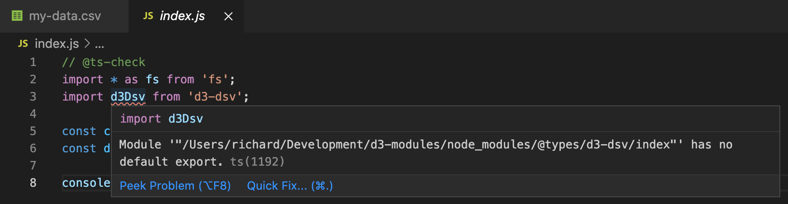
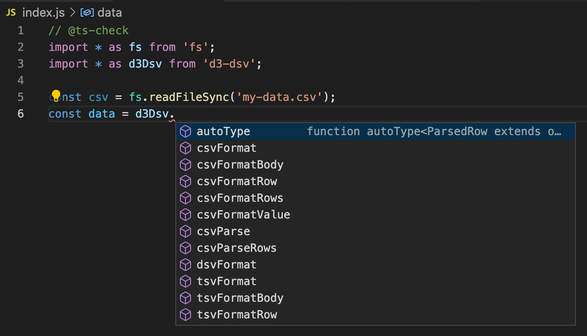
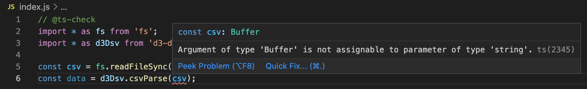
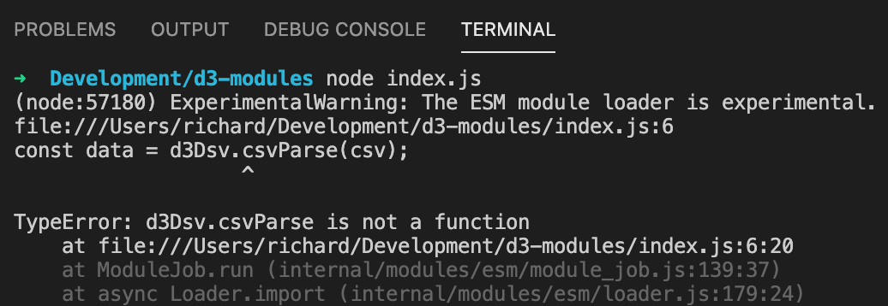
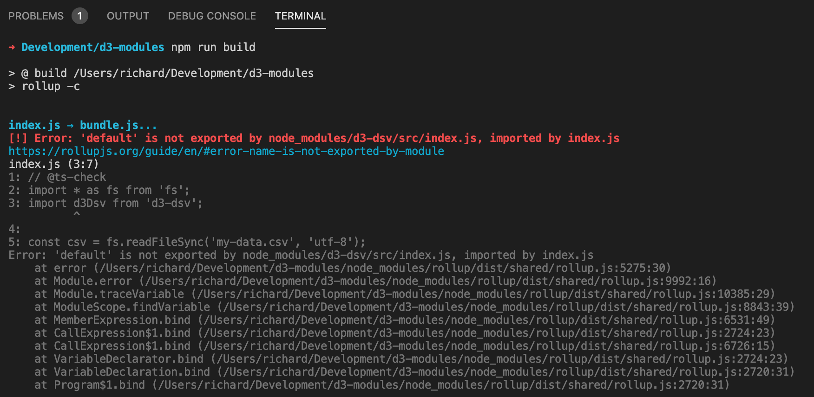

# d3-modules

Accompanying repo for [d3/d3#3469](https://github.com/d3/d3/issues/3469).

As of Node 12 (which is to say all maintained Node versions bar 10, which reaches EOL in April), it's possible for a Node project to use native JavaScript modules by adding the following to `package.json`:

```
{
  "type": "module"
}
```

Let's say you're making such a project, and you want to use (say) `d3-dsv`, and for extra points you're using TypeScript, so that your `package.json` looks like this...

```json
{
  "devDependencies": {
    "@types/d3-dsv": "^2.0.1",
    "@types/node": "^14.14.28",
    "typescript": "^4.1.5"
  },
  "dependencies": {
    "d3-dsv": "^2.0.0"
  },
  "type": "module"
}
```

...and your `tsconfig.json` looks like this:

```json
{
  "compilerOptions": {
    "allowJs": true,
    "moduleResolution": "node",
    "noEmit": true
  }
}
```

In a JavaScript file, which has `// @ts-check` at the top to enable typechecking, you import `d3-dsv` but discover that TypeScript yells at you:



According to `@types/d3-dsv`, there's no default export — you need to use named imports instead. So we switch to using a `*` import, and now we get nice autocomplete...



...and typechecking:



But when we run the program, it fails:



That's because Node believes that `d3-dsv` is a CommonJS package. When CommonJS is imported from ESM, Node treats `module.exports` as the default export. In other words, `@types/d3-dsv` disagrees with `d3-dsv` itself about what it exports.

It's not just TypeScript though — `d3-dsv` disagrees with _itself_ about its exports. That's because (like all D3 packages) it follows the well-established convention of providing both `pkg.main` and `pkg.module`...

```json
{
  "main": "dist/d3-dsv.js",
  "module": "src/index.js"
}
```

...which means that Node can ingest the CommonJS distributable version, while bundlers like Rollup ingest the modern source code. These bundlers, like TypeScript, expect to find named exports:



In other words, if you're using native JavaScript modules, you have a choice: you can write D3 programs that run in Node, or you can write D3 programs that typecheck and can be bundled. **You can't do both.**


## We can fix this!

Luckily this is easily solved, with one small caveat: we add `"type": "module"` to the `package.json` files in each package, alongside `"exports"` (which is how Node resolves e.g. `d3-dsv` to `node_modules/d3-dsv/src/index.js`):

```diff
  "main": "dist/d3-dsv.js",
  "unpkg": "dist/d3-dsv.min.js",
  "jsdelivr": "dist/d3-dsv.min.js",
  "module": "src/index.js",
+ "type": "module",
+ "exports": {
+   "import": "./src/index.js",
+   "require": "./dist/d3-dsv.js"
+ },
  "bin": {
```

(In future, it might even be possible to get rid of the `dist` folder once native modules are universally adopted alongside import maps etc, but I'm not suggesting that any time soon given how D3 is used in the wild.)

The caveat is that this is _technically_ a breaking change requiring a semver major release, since someone might currently be using these packages via `import` and would expect to be able to continue using the default import. We're talking about fairly extreme early adopters who can probably adapt very easily, and you could argue that the current behaviour is buggy and therefore can be fixed in a patch version. But if it was deemed necessary to support those users, it could be done in a non-breaking way by adding a default export alongside the named exports. For example:

```diff
-export {default as dsvFormat} from "./dsv.js";
-export {csvParse, csvParseRows, csvFormat, csvFormatBody, csvFormatRows, csvFormatRow, csvFormatValue} from "./csv.js";
-export {tsvParse, tsvParseRows, tsvFormat, tsvFormatBody, tsvFormatRows, tsvFormatRow, tsvFormatValue} from "./tsv.js";
-export {default as autoType} from "./autoType.js";
+import {default as dsvFormat} from "./dsv.js";
+import {csvParse, csvParseRows, csvFormat, csvFormatBody, csvFormatRows, csvFormatRow, csvFormatValue} from "./csv.js";
+import {tsvParse, tsvParseRows, tsvFormat, tsvFormatBody, tsvFormatRows, tsvFormatRow, tsvFormatValue} from "./tsv.js";
+import {default as autoType} from "./autoType.js";
+
+export {dsvFormat, csvParse, csvParseRows, csvFormat, csvFormatBody, csvFormatRows, csvFormatRow, csvFormatValue, tsvParse, tsvParseRows, tsvFormat, tsvFormatBody, tsvFormatRows, tsvFormatRow, tsvFormatValue, autoType};
+
+export default {dsvFormat, csvParse, csvParseRows, csvFormat, csvFormatBody, csvFormatRows, csvFormatRow, csvFormatValue, tsvParse, tsvParseRows, tsvFormat, tsvFormatBody, tsvFormatRows, tsvFormatRow, tsvFormatValue, autoType};
```

---

Thanks for reading this far! Obsessing over details like these is no-one's idea of a good time. However, now that the shift to a native module ecosystem is [well and truly underway](https://blog.sindresorhus.com/get-ready-for-esm-aa53530b3f77), more and more people will start to encounter these issues, and steps like these can minimise the frustration they experience.

D3 has shown impressive leadership in this area in the past and played a crucial role in helping to shift the JS ecosystem towards native modules, so this feels like a natural next step. Onward!